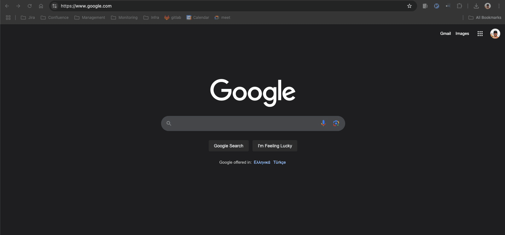
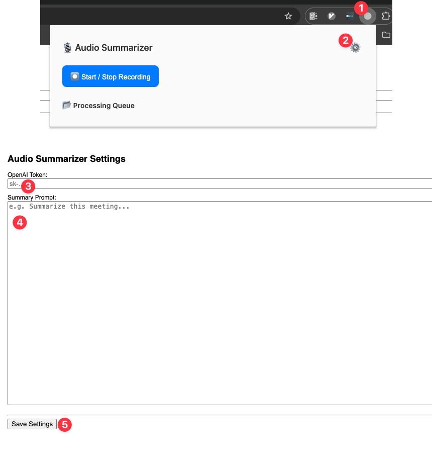
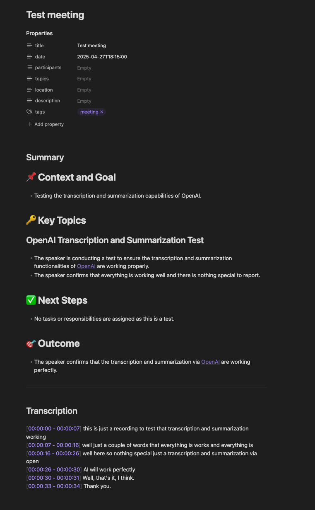

# Audio Transcriber & Summarizer for Google Meet


This is a audio transcriber and summarizer standalone Chrome Extension for Google Meet calls.

## 🤌 Motivation

I wanted to create a tool that would help me summarize audio files of my Google Meet calls.
All the tools I found were either too expensive or not good enough with multilingual support.

## 🚀 Features

- Transcription: whisper AI model
- Summarization: ChatGPT models
- gathering Google Meet call metadata (title, description, participants, time, location, etc)
- Obsidian integration: the final file can be saved in the Obsidian vault with metadata

## 🚧 Limitations

- only Google Chrome & Meet are supported

## 🛠️ Installation

You need to install the Chrome Extension.

1. Open Chrome Extensions page: chrome://extensions/
2. Enable Developer mode
3. Click on Load unpacked
4. Select the extension directory: chrome-extension



Then you need to set up the following settings in the extension:



- **OpenAI API Key**: You need to set up your OpenAI API key in the extension settings. You can get your API key from the [OpenAI website](https://platform.openai.com/signup).
- Summarization Prompt: You can set up your own summarization prompt in the extension settings. The default prompt is "Summarize the following text in a few bullet points".

Example of the prompt:

```markdown
You are an assistant tasked with creating a **detailed** summary from meeting transcripts.
The summary must be **comprehensive** and reflect **ALL key points**, including:
- questions, ideas, decisions, plans, discussions, disagreements, and alternative proposals.
- **Maximum level of detail**, avoiding generalizations.

**Important requirements**:
1. **DO NOT omit** even minor details of the discussion.
2. Reflect **all contexts, even if they seem secondary**.
3. **Avoid over-generalizing**, convey the **original meaning** of the statements.
4. **Avoid** using phrases like "X said" or "Y proposed," since the transcript does not always make it clear
who exactly expressed an opinion.

**Format: Markdown**
- Tags should be in English (maximum 5).
- Wrap key concepts, team names, and people in wiki-links: [[concept]].
- Use line breaks for lines longer than 120 characters.

### **Format example**:
#tag1 #tag2 #tag3

# 📌 Context and Goal
- Main discussion topics
    - Detailed breakdown

# 🔑 Key Topics
## Issue X
- Different perspectives on the issue
- Alternative solutions
- Key arguments

# ✅ Next Steps
- What needs to be done
- Who is responsible for each task

# 🎯 Outcome
- Meeting conclusions
- Decisions made
```

That's it! You can now use the extension to gather metadata from Google Meet calls and record audio.

## 🚀 Usage

After installation, you will see the extension icon in the top right corner of the Chrome browser.
Better to pin it to the toolbar for easier access.

Usage is extremely simple:

1. Click on the extension icon and "Start/Stop recording" button to start recording. During recording, the icon will change to red.
2. Click on the extension icon and "Start/Stop recording" button again to stop recording. The icon will change back to the original state.
3. Close the Google Meet tab or click on the "Leave call" button to stop recording.

After the call is finished, the following actions will be proceed:

- extension will gather metadata from the Google Meet call, transcribe and summarize the audio file
- chrome extension will show a popup with the transcription, summary and call metadata
- you can modify all the fields and copy the final result to the clipboard or download it as a file


### Obsidian Integration

The final file can be saved in the Obsidian vault with metadata:



## 🛣️ Roadmap

- [ ] Support for other video conferencing tools (Zoom, Teams, etc)
- [ ] Speaker recognition

## ☠️ Disclaimer

- This is an MVP project and you should take into account the following risks:
  - Check the source code before using it to understand what it does
  - The project is tested only on my machine and may not work on yours
- Legal:
  - Recording audio files may be illegal in your country
  - Better to ask for permission before recording audio files

## 📝 License

This project is licensed under the MIT License - see the [LICENSE](LICENSE) file for details.
